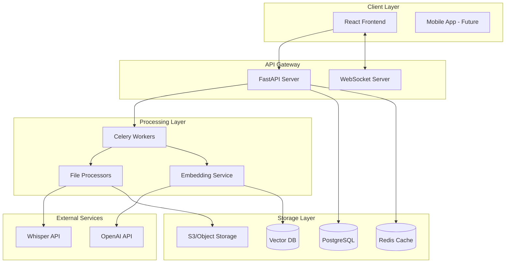
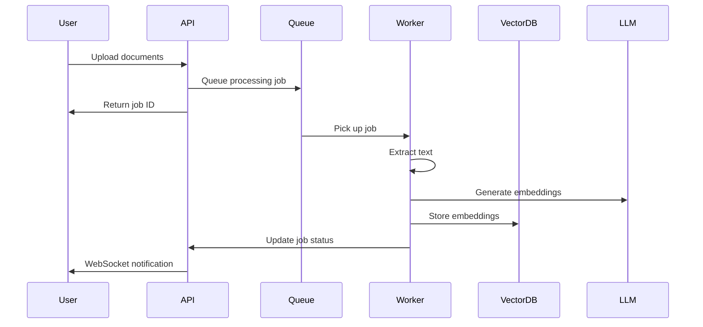
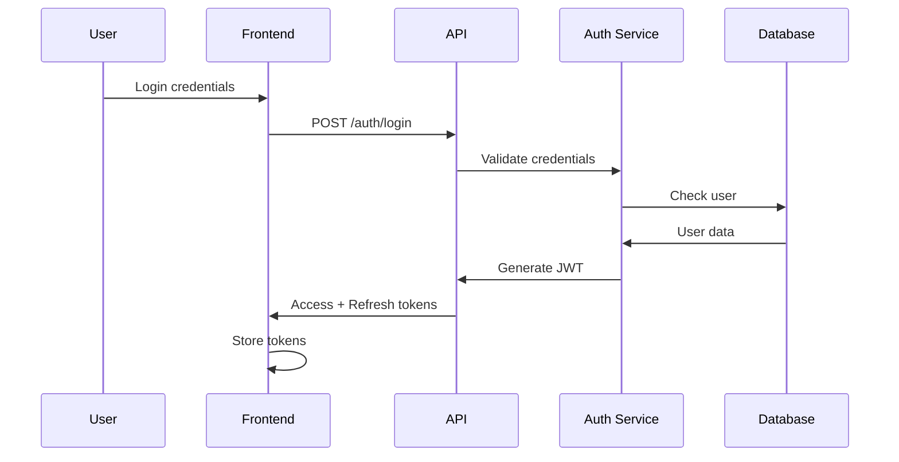

# System Architecture

## Overview

The RAG Platform is built with a microservices architecture designed for scalability, maintainability, and performance. The system processes various document types, generates embeddings, and creates intelligent AI agents using Retrieval-Augmented Generation.

## High-Level Architecture



## Component Details

### Frontend (React + TypeScript)

**Responsibilities:**
- User interface for document upload and agent interaction
- Real-time progress updates via WebSocket
- Responsive chat interface
- Analytics dashboard

**Key Technologies:**
- React 18 with hooks
- TypeScript for type safety
- Tailwind CSS for styling
- Recharts for analytics
- Socket.io client for WebSocket

### Backend API (FastAPI)

**Responsibilities:**
- RESTful API endpoints
- Authentication and authorization
- Request validation
- WebSocket connections
- Background job queuing

**Key Endpoints:**
- `POST /api/agents` - Create new agent
- `POST /api/documents` - Upload documents
- `GET /api/agents/{id}/chat` - Chat with agent
- `WebSocket /ws/processing/{job_id}` - Processing updates

### Processing Pipeline



### File Processors

**Supported Formats:**
1. **PDF**: PyPDF2, pdfplumber
2. **Video**: Whisper API for transcription
3. **PowerPoint**: python-pptx
4. **Word**: python-docx
5. **Images**: OCR with Tesseract

**Processing Strategy:**
- Chunking: Recursive text splitting with overlap
- Metadata extraction: Title, author, timestamps
- Optimization: Parallel processing for large files

### Vector Storage

**Implementation Options:**
1. **Pinecone** (Recommended for production)
   - Managed service
   - Built-in scaling
   - Hybrid search support

2. **Qdrant** (Self-hosted option)
   - Open source
   - Docker deployment
   - Full control

**Indexing Strategy:**
- Embedding model: OpenAI text-embedding-ada-002
- Dimension: 1536
- Similarity metric: Cosine
- Metadata filtering: Document type, user ID, timestamps

### Caching Layer

**Redis Implementation:**
- Query result caching (TTL: 1 hour)
- Session management
- Rate limiting counters
- Job queue backend

**Cache Strategy:**
```python
# Cache key pattern
query_cache_key = f"query:{user_id}:{agent_id}:{query_hash}"
embedding_cache_key = f"embedding:{content_hash}"
```

## Data Flow

### Document Upload Flow

1. User uploads file through frontend
2. API validates file and creates job
3. File stored in object storage
4. Job queued in Celery
5. Worker processes file:
   - Extract text content
   - Split into chunks
   - Generate embeddings
   - Store in vector DB
6. Update job status
7. Notify user via WebSocket

### Query Flow

1. User sends query to agent
2. API checks cache
3. If not cached:
   - Generate query embedding
   - Search vector DB
   - Retrieve relevant chunks
   - Construct prompt
   - Call LLM
   - Cache result
4. Stream response to user

## Security Architecture

### Authentication Flow


### Security Measures

1. **Authentication**: JWT with refresh tokens
2. **File Security**: 
   - Virus scanning with ClamAV
   - File type validation
   - Size limits
3. **API Security**:
   - Rate limiting
   - CORS configuration
   - Input sanitization
4. **Data Privacy**:
   - User data isolation
   - Encryption at rest
   - GDPR compliance

## Scalability Considerations

### Horizontal Scaling

- **API Servers**: Load balanced with nginx
- **Workers**: Scale based on queue depth
- **Database**: Read replicas for queries
- **Cache**: Redis cluster mode

### Performance Optimizations

1. **Embedding Generation**:
   - Batch processing
   - Caching frequently used embeddings
   - Async processing

2. **Vector Search**:
   - Approximate nearest neighbor
   - Metadata pre-filtering
   - Result caching

3. **File Processing**:
   - Chunked uploads
   - Parallel processing
   - Progress streaming

## Monitoring & Observability

### Metrics Collection

- **Prometheus** for metrics
- **Grafana** for visualization
- **Sentry** for error tracking

### Key Metrics

1. **API Metrics**:
   - Request rate
   - Response time
   - Error rate

2. **Processing Metrics**:
   - Queue depth
   - Processing time per file type
   - Success/failure rate

3. **System Metrics**:
   - CPU/Memory usage
   - Database connections
   - Cache hit rate

## Deployment Architecture

### Production Setup

```yaml
# docker-compose.production.yml
version: '3.8'
services:
  api:
    image: rag-platform/api:latest
    replicas: 3
    environment:
      - DATABASE_URL=${DATABASE_URL}
    
  worker:
    image: rag-platform/worker:latest
    replicas: 5
    environment:
      - CELERY_BROKER_URL=${REDIS_URL}
  
  nginx:
    image: nginx:alpine
    volumes:
      - ./nginx.conf:/etc/nginx/nginx.conf
    ports:
      - "80:80"
      - "443:443"
```

### Infrastructure Requirements

- **Minimum**: 2 vCPU, 4GB RAM
- **Recommended**: 4 vCPU, 16GB RAM
- **Storage**: 100GB+ for documents
- **Network**: WebSocket support required

## Future Enhancements

1. **Multi-tenancy**: Complete isolation per organization
2. **Plugin System**: Custom processors and retrievers
3. **Federated Learning**: Privacy-preserving improvements
4. **Edge Deployment**: Local processing options